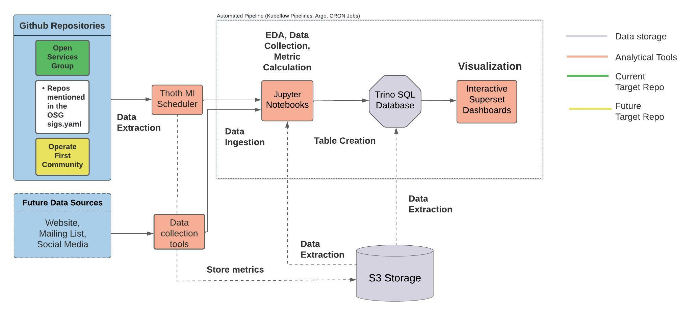

# Metrics

This repository is for the Metrics sub-project part of the [Data Science SIG](https://github.com/open-services-group/community/tree/main/sig-data-science). The project focuses on measuring and tracking the progress and contribution made across the Open Services group.

## Project Goals

The main goals of the project are to:

* Establish measurements for progress and contribution of Open Services group initiatives
* Implement an automated and reproducible end-to-end metric processing pipeline/workflow that can be widely adopted across teams

## Responsibilities

This project is mainly responsible for the following tasks:

* Aggregation and collection of metrics from different data sources such as GitHub
* Metric analysis (via Jupyter notebooks)
* Develop interactive dashboards (Superset/Grafana) for presenting and visualizing the metrics

All of the above tasks will be integrated into an automated pipeline/workflow.

## Project Architecture

The project architecture is as follows:

## Contribute

We encourage and welcome anyone to contribute to the project. A first step to contributing is to take a look at the [issues](https://github.com/open-services-group/metrics/issues) in the repository and identify the ones you would like to work on, attend the [project meetings](https://github.com/open-services-group/community/tree/main/sig-data-science#meetings) and join the communication channels.
